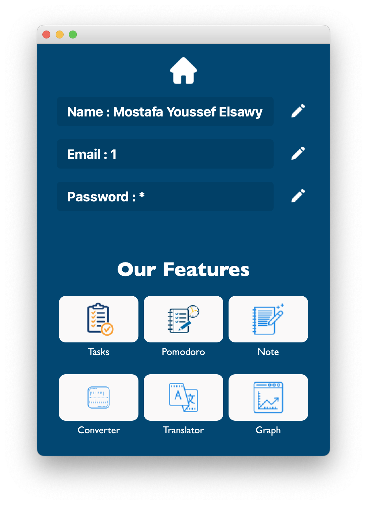

# Productivity And Studying Assistant

## About the Project:

I developed a Desktop Application for studying assistance needs. The students can increase their productivity rate and save their time using the Pomodoro technique. I Used Database SQLite to keep the data of the project. I also led and worked with my team for the college on this project.

+ The Project Contains a registration system as you can see below in the images provided.

## Technologies
  
  + Phthon3.
  
  + PyQt5 For the GUI of the application.
  
  + CSS to make a good style for each page on the application.
  
  + SqLite Database to keep the data of the project

## Features:

- [x] To-do List feature which students can use to write the tasks they want to do.

- [x] Pomodoro Technique which counts 25 Minutes for you to work on your tasks.

- [x] Note page which the students can write notes in.And registration system to the application.

- [x] Translator like Google translation that contains all languages.

- [x] Converter Between Numeral System,Length,Time and Bytes unites.

- [x] Graph diagram for students to show the performance in their last exams on an x-y axis.

## Setup
follow the following steps to run the project.

- You need to clone this repo on your local machine. 
 
- download python3 from [python.org](https://www.python.org/downloads/) 

- Run the following commands on your terminal or cmd to install the libraries that are used in the project.

  - run `pip install PyQt5` to install PyQt5.
  - run `pip install googletrans` to install googletrans.
  - run `pip install pyqtgraph` to install pyqtgraph.

- run the Main.py file.

## ScreenShots From the project:

